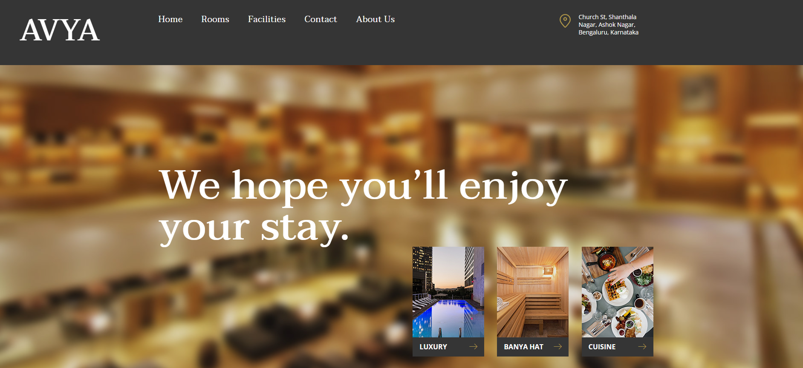
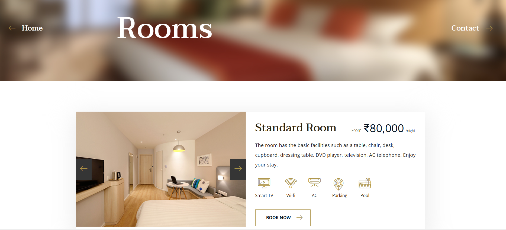
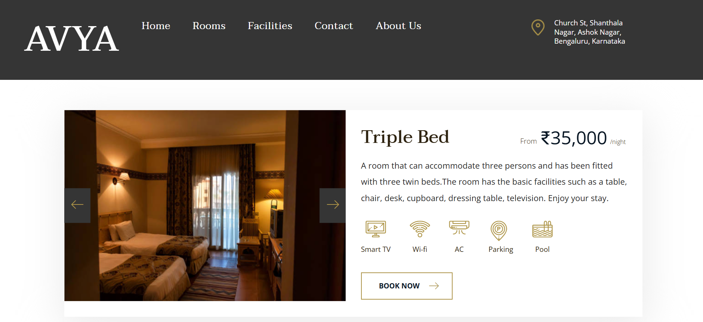
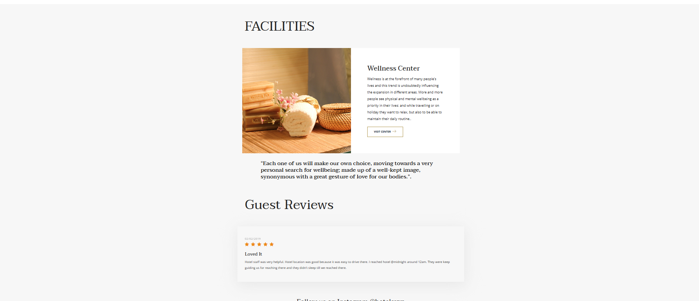
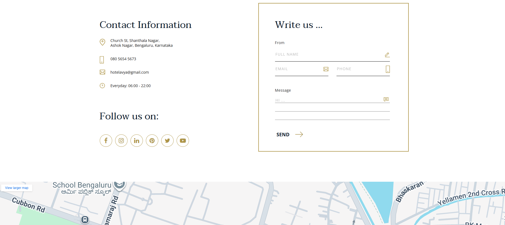

# Hotel Management System

## Overview
A static hotel management and booking website designed to showcase hotel rooms, facilities, and services. The project focuses on clean UI design, structured navigation, and user-friendly presentation of hotel information.

**Live Demo:** https://anuven21.github.io/Hotel-Management-Web-App/

## Domain
Web Development | Hotel Management System

## Features
- Home page with hotel overview and highlights
- Room listings with details and pricing
  - Standard Room
  - Junior Suite
  - Senior Suite
- Facilities section including:
  - Swimming Pool
  - Wellness & Spa
  - Cuisine
  - Banya Hat
- Room booking page
- About Us and Contact pages
- Responsive navigation bar with dropdown menus

## Tech Stack
- HTML
- CSS
- JavaScript
- Bootstrap

## Project Structure
```text
Hotel-Management-System/
│── booking/           # Room booking pages
│── rooms/             # Room listings and room detail pages
│── facilities/        # Hotel facilities (pool, wellness, cuisine, etc.)
│── pages/             # About Us and Contact pages
│── css/               # Stylesheets
│── js/                # JavaScript files
│── img/               # Images and static assets
│── fonts/             # Font files
│── screenshots/       # Project screenshots
│── index.html         # Home page
│── README.md
```

## Screenshots
### Home Page
Landing page showcasing the hotel overview, navigation menu, and quick access to key sections of the website.  


### Room Page
Displays available room types with details such as pricing, amenities, and room descriptions for user selection.  


### Booking Page
Allows users to select room options, enter booking details, and proceed with the reservation process.  


### Facilities Page
Highlights hotel facilities and services provided to guests, enhancing the overall user experience.  


### Contact Page
Provides contact details and inquiry options for users to reach the hotel for support or additional information.  


## How to Run
1. Clone the repository
2. Open `index.html` in any modern web browser
3. Navigate through the website using the menu

## Learning Outcomes
- Improved understanding of website folder structuring
- Hands-on experience with relative paths in HTML
- Better UI organization using Bootstrap
- Practice in building multi-page static websites

## Future Improvements
- Add backend for real booking system
- User authentication